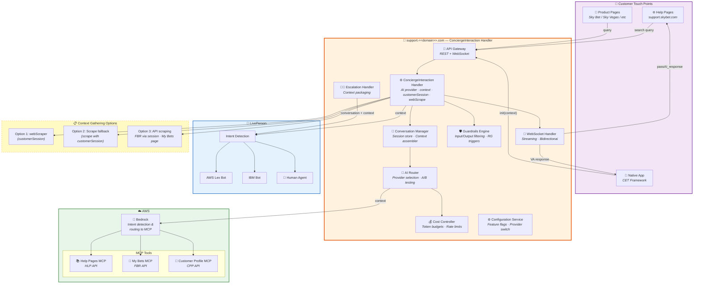
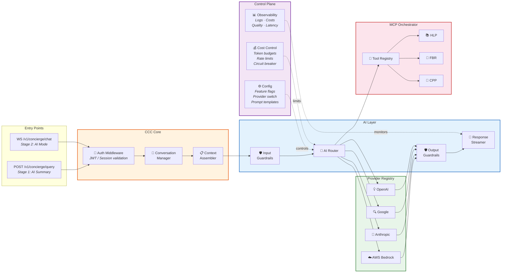
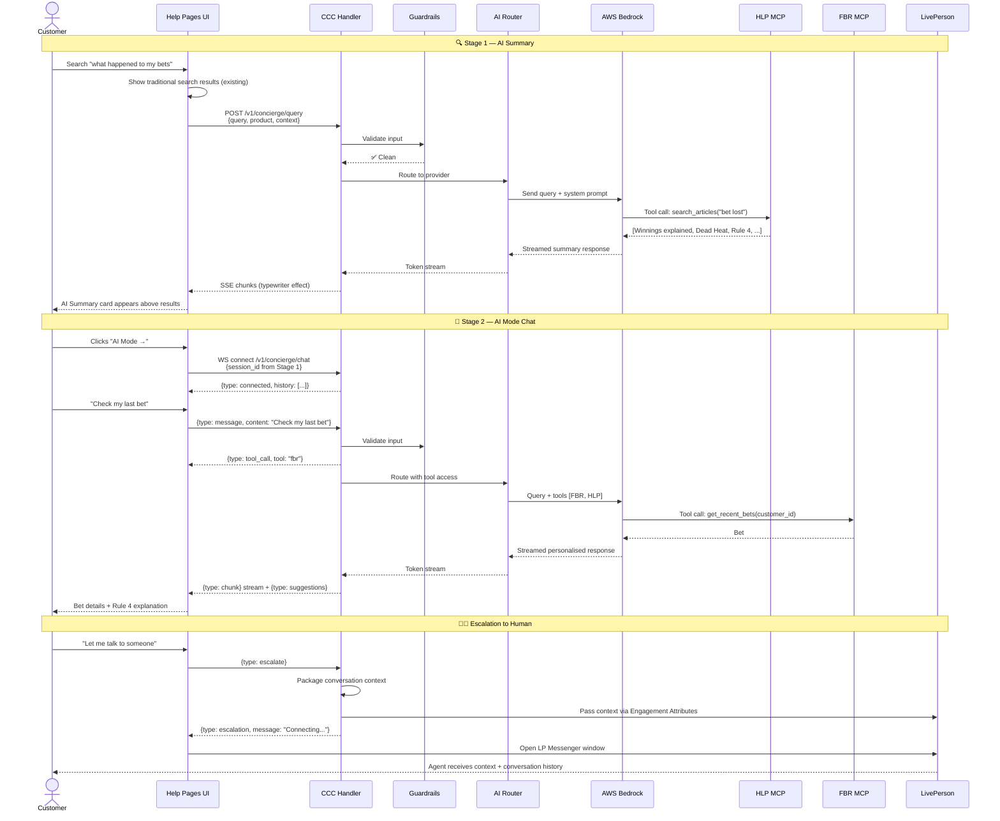
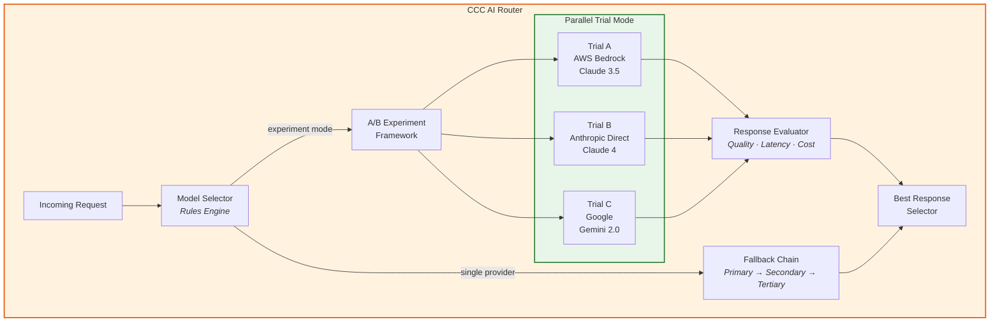
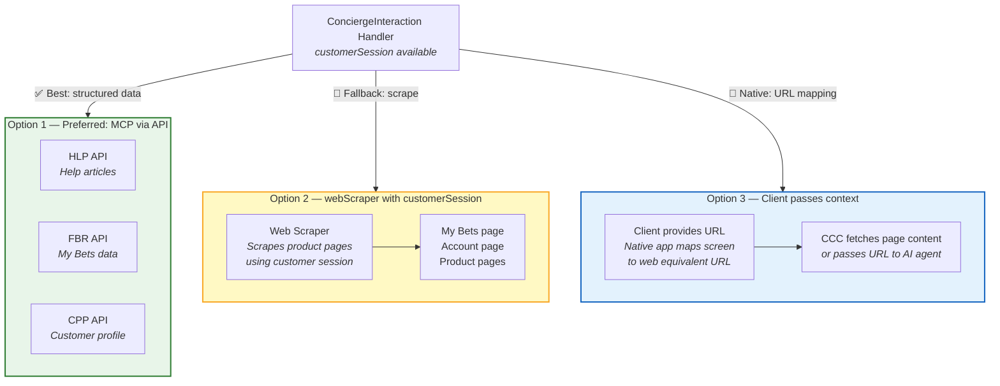
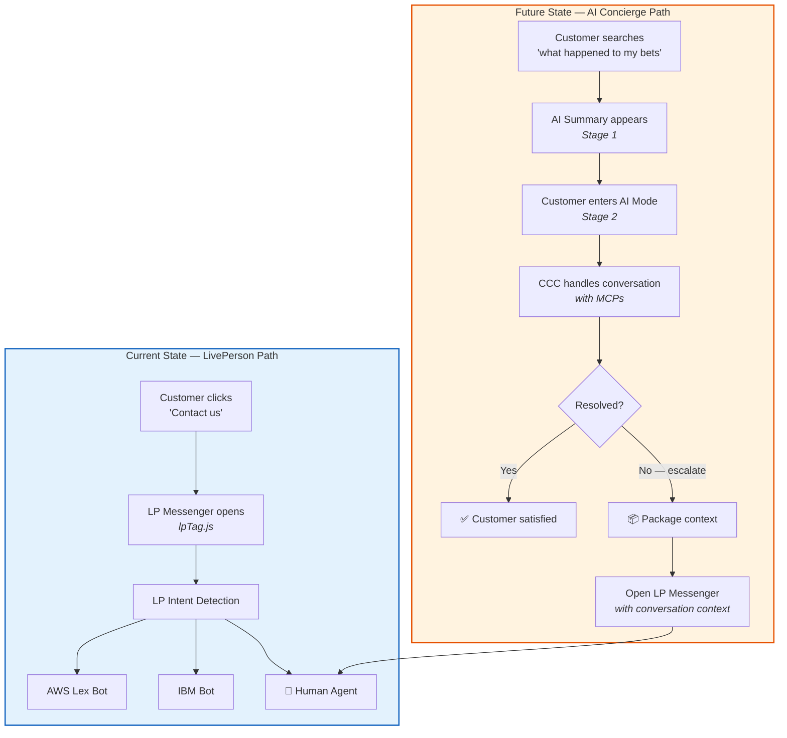
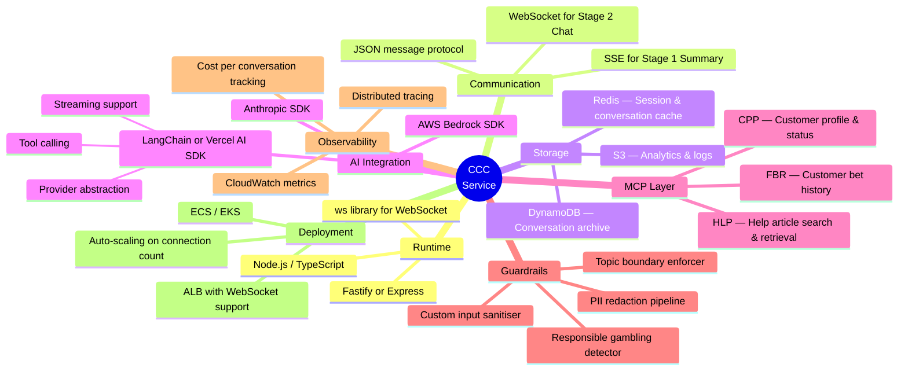
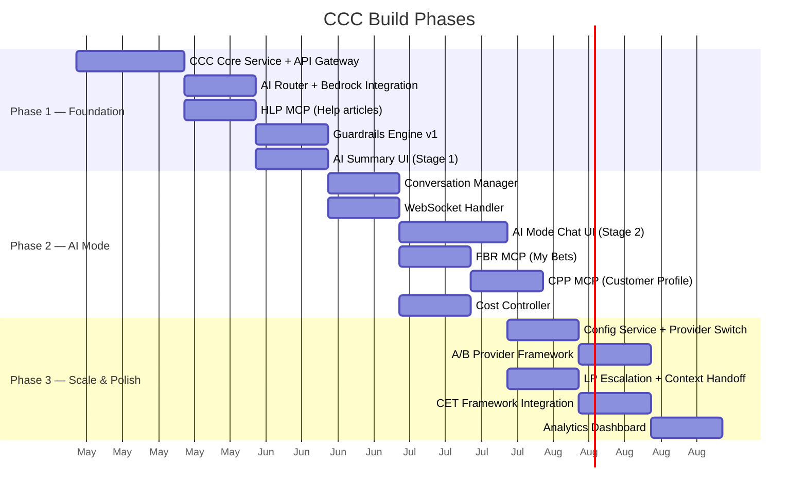

# AI Concierge — Architecture Diagrams

> Executive-friendly Mermaid diagrams aligned with the Slingshot AI Concierge vision.  
> Render these in any Mermaid-compatible viewer (GitHub, Notion, Confluence, VS Code, etc.)

---

## 1. High-Level System Overview

This is the full picture — how the CCC (ConciergeInteraction Handler) sits at the centre of everything.

---

## 2. CCC Internal Architecture — What We Build

This diagram focuses purely on the CCC service internals — our build scope.

---

## 3. Customer Journey — Sequence Flow

Shows the full flow from search → AI Summary → AI Mode → Escalation.

---

## 4. AI Provider Strategy — Parallel Trial Architecture

Shows how CCC enables trialling multiple LLM providers simultaneously.

---

## 5. Context Gathering Strategy

Three approaches from the Slingshot vision for getting customer-specific context.

---

## 6. LivePerson Integration & Escalation Path

The dual-path architecture: LP as legacy provider + CCC as new AI layer.

---

## 7. Technology Stack Decision

---

## 8. CCC Build Phases — Roadmap

---

> **Next:** See [ccc-components.md](./ccc-components.md) for detailed component specifications.
