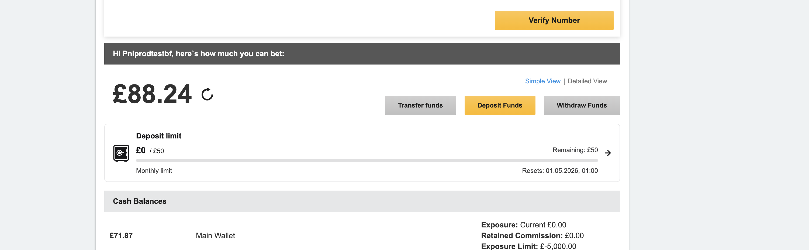
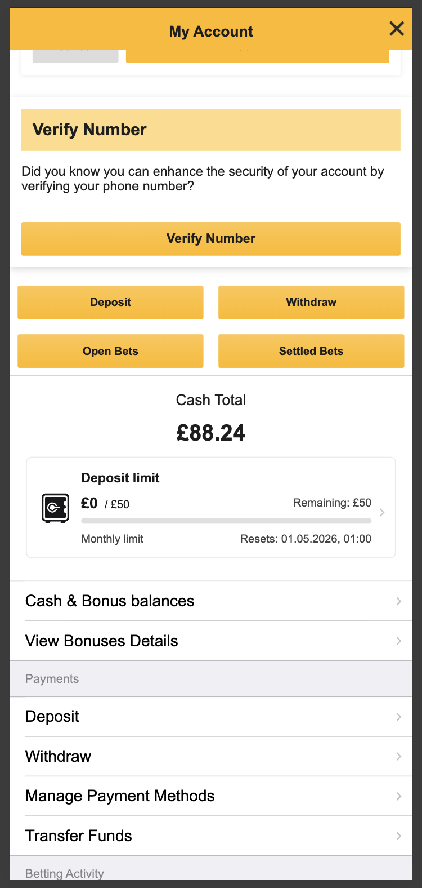
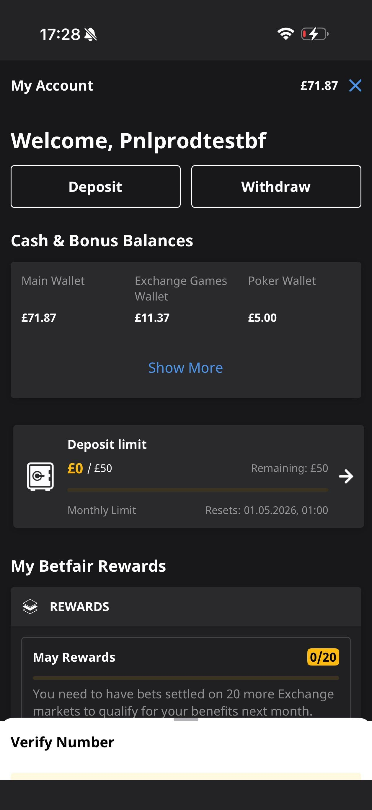

# Deposit Limit Widget

> **What it is:** A persistent UI component showing the user's current deposit limit usage with a visual progress bar.
>
> **See also:** [Spend Budget Alert](./SPEND-BUDGET-ALERT.md) for the threshold notification feature.

---

## Visual Reference

| Platform | Screenshot |
|----------|------------|
| **Desktop Web** |  |
| **Mobile Web** |  |
| **Native App** |  |

**What it shows:**
```
┌─────────────────────────────────────────────────────────────┐
│  🔒 Deposit limit                            Remaining: £50 │
│     £0 / £50                                                │
│     ████████████████████████████████████ (0% used)         │
│     Monthly limit                 Resets: 01.05.2026, 01:00 │
└─────────────────────────────────────────────────────────────┘
```

---

## Key Characteristics

| Attribute | Value |
|-----------|-------|
| **Visibility** | Always visible in My Account (when user has active limits) |
| **Purpose** | Show current deposit limit usage and remaining amount |
| **Interaction** | Click → Opens MSB Spend Budget hub |
| **Dismissible** | No |
| **Platforms** | Web (MAX) + Native (TBD) |
| **Control Owner** | **MAX** (not AMS) |
| **Data Flow** | MAX → MSB → PLS |

---

## Data Flow: Web (MAX)

```
┌─────────────────────────────────────────────────────────────────────────────────────┐
│                              WEB (MAX) - Deposit Limit Widget                        │
│                                                                                      │
│  Control Owner: MAX (throttles: affordability, HVNA-593_unified...)                 │
│  AMS: NOT INVOLVED in this feature                                                  │
└─────────────────────────────────────────────────────────────────────────────────────┘

  User opens My Account page
           │
           ▼
┌─────────────────────────────────────────────────────────────────────────────────────┐
│  MAX FRONTEND                                                                        │
│                                                                                      │
│  Trigger URLs:                                                                       │
│  • /myaccountx/rest/retrieveDesktopNavigation                                       │
│  • /summary/accountsummary                                                          │
│  • /api/myAccountNavigation                                                         │
│  • /account/navigation                                                              │
│                                                                                      │
│  Data retrieved from: platformConfig.getBudgetNdl() or getUnifiedDepositLimits()   │
└─────────────────────────────────────────────────────────────────────────────────────┘
           │
           │ HTTP (page load - data embedded server-side)
           ▼
┌─────────────────────────────────────────────────────────────────────────────────────┐
│  MAX BACKEND - UserContextInterceptor.java                                          │
│                                                                                      │
│  Two flows controlled by throttles:                                                  │
│                                                                                      │
│  ┌─────────────────────────────────────┐  ┌─────────────────────────────────────┐   │
│  │  LEGACY FLOW                        │  │  NEW FLOW (HVNA-593)                │   │
│  │  Throttle: "affordability"          │  │  Throttle: "HVNA-593_unified_..."   │   │
│  │                                     │  │                                     │   │
│  │  + Requires AFFORDABILITY_FLAGS     │  │  No flag check required             │   │
│  │  + Calls: /api/v1/budget-status     │  │  + Calls: /api/v1/deposit-limits    │   │
│  │  + Sets: primarySpendBudget         │  │  + Sets: unifiedDepositLimits       │   │
│  └─────────────────────────────────────┘  └─────────────────────────────────────┘   │
│                                                                                      │
│  AFFORDABILITY_FLAGS (required for legacy flow):                                    │
│  • rgiRequiredAccountLimited, sgiCompleteNdlSet                                     │
│  • sofInvestigationAccountLimited, sofInvestigationAccountLimitedHighRisk           │
│  • cddAccountLimited, cddInvestigationInProgress, cddInvestigationComplete          │
└─────────────────────────────────────────────────────────────────────────────────────┘
           │
           │ Circuit Breaker (Resilience4j) - 30% failure threshold, 20s recovery
           ▼
┌─────────────────────────────────────────────────────────────────────────────────────┐
│  MSB BACKEND - /api/v1/budget-status OR /api/v1/deposit-limits                      │
│                                                                                      │
│  Returns:                                                                            │
│  {                                                                                   │
│    amount: 50,              // Total limit                                          │
│    remainingAmount: 50,     // Remaining                                            │
│    totalDeposits: 0,        // Used                                                 │
│    period: "MONTH",         // WEEK, MONTH, etc.                                    │
│    category: "NDL",         // NDL, PDL, CDL, etc.                                  │
│    resetDateTime: { date: "01/05/2026", time: "01:00" }                            │
│  }                                                                                   │
└─────────────────────────────────────────────────────────────────────────────────────┘
           │
           │ Cougar RPC
           ▼
┌─────────────────────────────────────────────────────────────────────────────────────┐
│  PLS (Payment Limits Service)                                                        │
│                                                                                      │
│  Returns: Account limits, nextBreachableLimit flag, reset dates                     │
└─────────────────────────────────────────────────────────────────────────────────────┘
```

### Web Component Files

| File | Purpose |
|------|---------|
| `frontend/common/services/platformConfig.service.js` | `getBudgetNdl()`, `getUnifiedDepositLimits()` |
| `frontend/common/pages/accountSummary/components/mainWallet.component.js` | Reads from platformConfig |
| `frontend/common/components/depositLimitCard/deposit-limit-card.component.js` | Widget UI (new design) |
| `frontend/common/components/budget-status/budget-status.component.js` | Widget UI (legacy) |
| `application/.../web/interceptor/UserContextInterceptor.java` | Server-side data fetch |
| `application/.../services/msb/MySpendBudgetService.java` | MSB client with circuit breaker |

---

## Data Flow: Native (TBD)

```
┌─────────────────────────────────────────────────────────────────────────────────────┐
│                           NATIVE (TBD) - Deposit Limit Widget                        │
│                                                                                      │
│  Flow: TBD → CET Framework → BFF → MAX → MSB → PLS                                  │
└─────────────────────────────────────────────────────────────────────────────────────┘

  User opens My Account screen
           │
           ▼
┌─────────────────────────────────────────────────────────────────────────────────────┐
│  TBD FRONTEND (React Native)                                                         │
│                                                                                      │
│  GraphQL Query (card_query.graphql):                                                │
│  query Card($urn: [URN!]!) {                                                        │
│    Cards(cardsURN: $urn) {                                                          │
│      ...budgetLimitsCard                                                            │
│    }                                                                                │
│  }                                                                                   │
└─────────────────────────────────────────────────────────────────────────────────────┘
           │
           ▼
┌─────────────────────────────────────────────────────────────────────────────────────┐
│  CET FRAMEWORK (@flutter-global/react-native-cet-framework)                          │
│                                                                                      │
│  • Authentication wrapper for all customer service calls                            │
│  • Session management (ApiSession, loginCookies)                                    │
│  • Provides: useLogin, useJoinNow, CetContext                                       │
│  • Handles auth tokens for downstream API calls                                     │
└─────────────────────────────────────────────────────────────────────────────────────┘
           │
           │ GraphQL Request (with auth context)
           ▼
┌─────────────────────────────────────────────────────────────────────────────────────┐
│  BFF (Backend For Frontend) - api/tbd/bff-gql/[version]/                            │
│                                                                                      │
│  GraphQL Gateway resolves BudgetLimitsCard fragment                                 │
└─────────────────────────────────────────────────────────────────────────────────────┘
           │
           │ REST HTTP (internal)
           ▼
┌─────────────────────────────────────────────────────────────────────────────────────┐
│  MAX BACKEND                                                                         │
│                                                                                      │
│  • Platform detection (CustomDeviceResolver) → device.isNative = true               │
│  • Feature filtering (FeaturesInterceptor)                                          │
│  • Circuit Breaker (Resilience4j)                                                   │
└─────────────────────────────────────────────────────────────────────────────────────┘
           │
           │ REST HTTP (internal)
           ▼
┌─────────────────────────────────────────────────────────────────────────────────────┐
│  MSB BACKEND - /api/v1/budget-status OR /api/v1/deposit-limits                      │
│                                                                                      │
│  Same endpoints as web - processes request and calls PLS                            │
└─────────────────────────────────────────────────────────────────────────────────────┘
           │
           │ Cougar RPC
           ▼
┌─────────────────────────────────────────────────────────────────────────────────────┐
│  PLS (Payment Limits Service)                                                        │
│                                                                                      │
│  Returns: Account limits, nextBreachableLimit flag, reset dates                     │
└─────────────────────────────────────────────────────────────────────────────────────┘
           │
           │ Response flows back up: PLS → MSB → MAX → BFF → TBD
           ▼
┌─────────────────────────────────────────────────────────────────────────────────────┐
│  BFF RESPONSE                                                                        │
│                                                                                      │
│  GraphQL Response (budgetLimitsCard):                                               │
│  {                                                                                   │
│    __typename: "BudgetLimitsCard"                                                   │
│    urn: "..."                                                                        │
│    limits: [{                                                                        │
│      amount: 50,                                                                     │
│      category: "NDL",                                                                │
│      remain: 50,                                                                     │
│      reset: "01/05/2026",                                                            │
│      nextBreachable: true                                                            │
│    }]                                                                                │
│  }                                                                                   │
└─────────────────────────────────────────────────────────────────────────────────────┘
           │
           ▼
┌─────────────────────────────────────────────────────────────────────────────────────┐
│  TBD STATE MANAGEMENT                                                                │
│                                                                                      │
│  1. Normalizer: budget-limits-card-normalizer.ts                                    │
│     → Transforms GraphQL response to Redux state                                    │
│                                                                                      │
│  2. Selector: createNextBreachableLimitSelector()                                   │
│     → Finds limit with nextBreachable: true                                         │
│     → Filters out PDL category                                                      │
│                                                                                      │
│  3. Props Factory: createBudgetCard()                                               │
│     → Formats currency, reset date, builds link to SPEND_BUDGET endpoint            │
└─────────────────────────────────────────────────────────────────────────────────────┘
           │
           ▼
┌─────────────────────────────────────────────────────────────────────────────────────┐
│  UI COMPONENTS                                                                       │
│                                                                                      │
│  • Budget.web.tsx - Main widget container                                           │
│  • BudgetStats.web.tsx - Progress bar with amounts                                  │
│                                                                                      │
│  On click → Opens WebView to: https://myspendbudget.{brand}.com/my-budget           │
└─────────────────────────────────────────────────────────────────────────────────────┘
```

### Native Component Files

| File | Purpose |
|------|---------|
| `packages/tbd-store/clients/catalogue/card_query.graphql` | GraphQL query |
| `packages/tbd-store/services/catalogue/normalizer/cards/budget-limits-card/` | Normalizer + fragment |
| `packages/tbd-store/state/layout/cards/budget-limits/budget-limits-selectors.ts` | `createNextBreachableLimitSelector()` |
| `packages/tbd-shared/components/UserProfile/map-to-props-factory.ts` | `createBudgetCard()` |
| `packages/tbd-shared/components/UserProfile/snowflakes/Budget/Budget.web.tsx` | Widget container |
| `packages/tbd-shared/components/UserProfile/snowflakes/BudgetStats/BudgetStats.web.tsx` | Progress bar |

---

## Progress Bar Calculation

### Web (MAX)
```javascript
// UserContextInterceptor.java
budgetPercent = ((amount - remainingAmount) / amount) * 100

// Example: amount=50, remainingAmount=50
// budgetPercent = ((50-50)/50)*100 = 0%
```

### Native (TBD)
```typescript
// BudgetStats.web.tsx
const usedWidth = ((amount - remain) * 100) / amount;
const remainWidth = (remain * 100) / amount;

// Example: amount=50, remain=50
// usedWidth = 0%, remainWidth = 100%
```

---

## Primary Limit Selection

Both platforms use `nextBreachableLimit` from PLS to determine which limit to display:

| Priority | Logic |
|----------|-------|
| 1 | Use `nextBreachableLimit` if available |
| 2 | Fallback: smallest `remainingAmount` + period priority |
| 3 | Filter out PDL (Personal Deposit Limit) category |

**Supported Categories:**
- `NDL` - Net Deposit Limit (main)
- `NDL_AFF` - Affordability
- `NDL_AMLCDD` - AML/CDD
- `NDL_REACTIVATION` - Reactivation
- `NDL_SGI` - Safer Gambling
- `NDL_U25` - Under 25
- `NDL_VULNERABILITY` - Vulnerability
- `PDL` - Personal Deposit Limit (**filtered out in TBD**)

---

## Throttles

| Throttle | Effect |
|----------|--------|
| `affordability` | Enables legacy widget (requires AFFORDABILITY_FLAGS) |
| `HVNA-593_unified_deposit_limits_widget_max` | Enables new unified widget (no flag check) |

---

## Web vs Native Comparison

| Aspect | Web (MAX) | Native (TBD) |
|--------|-----------|--------------|
| **Data Source** | Server-rendered in `platformConfig` | GraphQL `BudgetLimitsCard` |
| **Request Path** | Page load → UserContextInterceptor | GraphQL → BFF → MAX → MSB |
| **State Management** | `userContext.primarySpendBudget` | Redux `cards.budgetLimits` |
| **Component** | `deposit-limit-card.component.js` | `Budget.web.tsx` |
| **Click Action** | Navigate to SGX hub | WebView to MSB portal |
| **Throttle Check** | Yes (`affordability` or `HVNA-593`) | No (catalogue-driven) |
