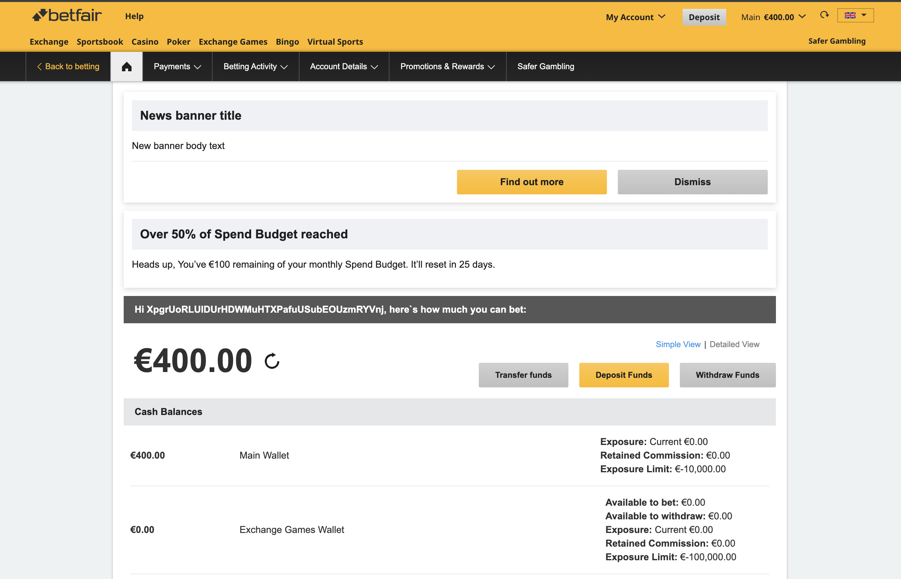

# Spend Budget Alert

> **What it is:** A dismissible notification/alert that appears when the user crosses spending thresholds (50%, 75%, etc.).
>
> **See also:** [Deposit Limit Widget](./DEPOSIT-LIMIT-WIDGET.md) for the progress bar component.

---

## Visual Reference

| Platform | Screenshot |
|----------|------------|
| **Desktop Web** |  |
| **Native App** | *See [conceptual mockup](images/native_spend_budget_banner_concept.md)* |

**What it shows:**
```
┌─────────────────────────────────────────────────────────────┐
│  ⚠️  Over 50% of Spend Budget reached              [×]      │
│                                                             │
│  Heads up, You've €100 remaining of your monthly Spend     │
│  Budget. It'll reset in 25 days.                           │
│                                                             │
│  ┌─────────────────┐  ┌────────────┐                       │
│  │  Find out more  │  │  Dismiss   │                       │
│  └─────────────────┘  └────────────┘                       │
└─────────────────────────────────────────────────────────────┘
```

---

## Key Characteristics

| Attribute | Value |
|-----------|-------|
| **Visibility** | Conditional - only when threshold crossed (50%, 75%, etc.) |
| **Purpose** | Alert user they're approaching their deposit limit |
| **Interaction** | "Find out more" or "Dismiss" |
| **Dismissible** | Yes |
| **Platforms** | Web (MAX) + Native (TBD) - both via AMS |
| **Control Owner** | **AMS** (not MAX) |
| **Data Flow** | MAX → AMS → MSB → PLS |

---

## AMS Role: budgetThresholdHit Banner

> **✅ Key Finding:** AMS **IS** the source of the Spend Budget Alert via `BudgetThresholdHitBannerService`. AMS calls MSB to get budget data and applies throttle conditions.

### AMS Banner Types

| Type | Priority | Source | Purpose |
|------|----------|--------|---------|
| `kyc` | 1 | AMS | KYC compliance banners |
| `news` | 2 | AMS | News banners |
| `rg` | 3 | AMS | Responsible gambling |
| `budget` | 4 | AMS | Budget information |
| `budgetThresholdHit` | 5 | **AMS → MSB** | **Spend Budget Alert** |
| `phone` | 6 | AMS | Phone verification |
| `paypal` | 7 | AMS | PayPal banners |

**Location:** `ams/application/src/main/java/com/betfair/service/ams/model/BannerType.java`

### Throttle Configuration

The `budgetThresholdHit` banner has throttle configuration:

```json
{
  "ams.banner.throttles.budgetThresholdHit": {
    "dimensions": [
      { "equalTo": "*" },
      { "oneOf": ["international", "pp_international", "sbg_international"] },
      { "oneOf": ["GB", "IE"] },
      { "oneOf": ["MY_ACCOUNT_SUMMARY", "MY_ACCOUNT", "TBD"] }
    ],
    "value": "{\"dateBetween\": {\"min\": \"1\",\"max\": \"20\"},\"percentBetween\": {\"min\": \"50\",\"max\": \"90\"}}"
  }
}
```

**Throttle Conditions:**
| Condition | Example | Meaning |
|-----------|---------|---------|
| `dateBetween.min/max` | 1-20 | Show banner only on days 1-20 of the month |
| `percentBetween.min/max` | 50-90 | Show banner when usage is between 50%-90% |

---

## Data Flow: Web (MAX)

```
┌─────────────────────────────────────────────────────────────────────────────────────┐
│                              WEB (MAX) - Spend Budget Alert                          │
│                                                                                      │
│  MAX → AMS → MSB → PLS                                                              │
└─────────────────────────────────────────────────────────────────────────────────────┘

  User loads page (My Account, etc.)
           │
           ▼
┌─────────────────────────────────────────────────────────────────────────────────────┐
│  MAX FRONTEND - banner.utils.js                                                      │
│                                                                                      │
│  fetch('/api/max/retrieveBannerInformation')                                        │
│  → processBanners(response.budgetThresholdHit)                                      │
└─────────────────────────────────────────────────────────────────────────────────────┘
           │
           │ REST API
           ▼
┌─────────────────────────────────────────────────────────────────────────────────────┐
│  MAX BACKEND - BannerController.java                                                 │
│                                                                                      │
│  @GetMapping("/retrieveBannerInformation")                                          │
│  public Response<Map<String, BannerInformation>> retrieveBannerInformation() {      │
│      return accountMessagingServiceAdapter.getBannerInformation(flow, bannerType);  │
│  }                                                                                   │
└─────────────────────────────────────────────────────────────────────────────────────┘
           │
           │ Cougar RPC
           ▼
┌─────────────────────────────────────────────────────────────────────────────────────┐
│  AMS - BudgetThresholdHitBannerService.java                                          │
│                                                                                      │
│  getBanners():                                                                       │
│    1. Check AFFORDABILITY_FLAGS (BESPOKE_NDL_SET, CDD_*, etc.)                      │
│    2. Check throttle conditions:                                                     │
│       - isInThrottledPeriod() → dateBetween (day 1-20 of month)                     │
│       - isInThrottledPercent() → percentBetween (50%-90%)                           │
│    3. Call MSB for budget status                                                     │
│    4. If all conditions met → return banner                                          │
└─────────────────────────────────────────────────────────────────────────────────────┘
           │
           │ REST HTTP (with session token)
           ▼
┌─────────────────────────────────────────────────────────────────────────────────────┐
│  MSB - SpendBudgetService.getBudgetStatus()                                          │
│                                                                                      │
│  GET /api/msb-{brand}/budget-status                                                 │
│  Headers: x-api-key, Cookie: ssoid={sessionToken}                                   │
│                                                                                      │
│  Returns:                                                                            │
│  {                                                                                   │
│    "primaryBudget": {                                                               │
│      "account": [{                                                                  │
│        "amount": 200,                                                               │
│        "remainingAmount": 90,                                                       │
│        "category": "NDL",                                                           │
│        "period": "MONTH",                                                           │
│        "resetDateTime": { "date": "2026-04-30", "time": "00:00:00" }               │
│      }]                                                                             │
│    }                                                                                │
│  }                                                                                   │
└─────────────────────────────────────────────────────────────────────────────────────┘
           │
           │ Cougar RPC
           ▼
┌─────────────────────────────────────────────────────────────────────────────────────┐
│  PLS (Payment Limits Service)                                                        │
│                                                                                      │
│  Returns: Account deposit limits, current usage, remaining amounts                  │
└─────────────────────────────────────────────────────────────────────────────────────┘
           │
           │ Response bubbles up: PLS → MSB → AMS → MAX
           ▼
┌─────────────────────────────────────────────────────────────────────────────────────┐
│  AMS RESPONSE (if conditions met)                                                    │
│                                                                                      │
│  {                                                                                   │
│    "budgetThresholdHit": {                                                          │
│      "title": "Over 50% of Spend Budget reached",                                   │
│      "bodyContentText": "Heads up, You've €90 remaining of your monthly...",        │
│      "priority": 5,                                                                 │
│      "attentionLevel": "WARNING"                                                    │
│    }                                                                                │
│  }                                                                                   │
└─────────────────────────────────────────────────────────────────────────────────────┘
```

### AMS Implementation Details

**BudgetThresholdHitBannerService.java:**
```java
@Component
public class BudgetThresholdHitBannerService implements BannerTypeService {

    private final List<String> AFFORDABILITY_FLAGS = ImmutableList.of(
            BESPOKE_NDL_SET,
            CDD_ACCOUNT_LIMITED, 
            CDD_INVESTIGATION_IN_PROGRESS, 
            CDD_INVESTIGATION_COMPLETE);

    @Override
    public List<BannerDetails> getBanners(...) {
        // 1. Check user has affordability flags
        var isAffordabilityFlow = isAffordabilityFlow(customerInfo);
        var maybeBannerThrottle = getBannerThrottle(bannerFilter);

        if (!isAffordabilityFlow || maybeBannerThrottle.isEmpty()) {
            return Collections.emptyList();
        }

        // 2. Check day of month is within throttle range (e.g., 1-20)
        var isInThrottledPeriod = isInThrottledPeriod(bannerThrottle);
        if (!isInThrottledPeriod) {
            return Collections.emptyList();
        }

        // 3. Call MSB for budget status
        var budgetStatus = spendBudgetService.getBudgetStatus(
            customerInfo.getBrand(), 
            sessionToken
        );

        // 4. Check percentage is within throttle range (e.g., 50-90%)
        if (isNull(budgetStatus)
                || !isValidBudget(budgetStatus)
                || !isInThrottledPercent(bannerThrottle, budgetStatus)) {
            return Collections.emptyList();
        }

        // 5. Build banner with metadata
        var metadata = getMetadata(budgetStatus, bannerThrottle, customerInfo);
        return adapt(bannersDetail, customerInfo, metadata);
    }
}
```

**Throttle Period Check:**
```java
private boolean isInThrottledPeriod(BannerThrottle bannerThrottle) {
    var dateBetween = throttle.getDateBetween();
    var today = LocalDate.now();
    int day = today.getDayOfMonth();
    return day >= dateBetween.getMin() && day <= dateBetween.getMax();
}
```

**Throttle Percent Check:**
```java
private boolean isInThrottledPercent(BannerThrottle bannerThrottle, SpendBudgetInfo budget) {
    var currentPercent = budget.getBudgetPercent();  // e.g., 55%
    var percentBetween = throttle.getPercentBetween();  // e.g., 50-90
    return currentPercent >= percentBetween.getMin() 
        && currentPercent <= percentBetween.getMax();
}
```

**Budget Percent Calculation (MSB):**
```java
// SpendBudgetService.java
private double calculateBudgetPercent(double remaining, double total) {
    if (remaining == 0) {
        return 100d;  // Fully used
    }
    return ((total - remaining) / total) * 100;
}
```

---

## Data Flow: Native (TBD)

```
┌─────────────────────────────────────────────────────────────────────────────────────┐
│                           NATIVE (TBD) - Spend Budget Alert                          │
│                                                                                      │
│  Flow: TBD → CET Framework → BFF → MAX → AMS → MSB → PLS                            │
└─────────────────────────────────────────────────────────────────────────────────────┘

  User opens app
           │
           ▼
┌─────────────────────────────────────────────────────────────────────────────────────┐
│  TBD FRONTEND (React Native)                                                         │
│                                                                                      │
│  GraphQL Query (card_query.graphql):                                                │
│  query Card($urn: [URN!]!) {                                                        │
│    Cards(cardsURN: $urn) {                                                          │
│      ...accountBannersCard                                                          │
│    }                                                                                │
│  }                                                                                   │
└─────────────────────────────────────────────────────────────────────────────────────┘
           │
           ▼
┌─────────────────────────────────────────────────────────────────────────────────────┐
│  CET FRAMEWORK (@flutter-global/react-native-cet-framework)                          │
│                                                                                      │
│  • Authentication wrapper for all customer service calls                            │
│  • Session management (ApiSession, loginCookies)                                    │
│  • Provides: useLogin, useJoinNow, CetContext                                       │
│  • Handles auth tokens for downstream API calls                                     │
└─────────────────────────────────────────────────────────────────────────────────────┘
           │
           │ GraphQL Request (with auth context)
           ▼
┌─────────────────────────────────────────────────────────────────────────────────────┐
│  BFF (Backend For Frontend) - api/tbd/bff-gql/[version]/                            │
│                                                                                      │
│  GraphQL Gateway resolves AccountBannersCard fragment                               │
└─────────────────────────────────────────────────────────────────────────────────────┘
           │
           │ REST HTTP (internal)
           ▼
┌─────────────────────────────────────────────────────────────────────────────────────┐
│  MAX BACKEND - Banner Service                                                        │
│                                                                                      │
│  Routes banner requests to appropriate services:                                    │
│  • AMS → budgetThresholdHit, KYC, compliance banners                               │
│  • Other → news, RG, phone, paypal banners                                          │
└─────────────────────────────────────────────────────────────────────────────────────┘
           │
           │ Cougar RPC (for budgetThresholdHit)
           ▼
┌─────────────────────────────────────────────────────────────────────────────────────┐
│  AMS BACKEND - BudgetThresholdHitBannerService                                       │
│                                                                                      │
│  1. Checks user affordability flags                                                 │
│  2. Checks throttle conditions (dateBetween, percentBetween)                        │
│  3. Calls MSB for budget percentage                                                 │
│  4. If all conditions met → returns banner                                          │
└─────────────────────────────────────────────────────────────────────────────────────┘
           │
           │ REST HTTP (AMS → MSB)
           ▼
┌─────────────────────────────────────────────────────────────────────────────────────┐
│  MSB BACKEND - /budget-status                                                        │
│                                                                                      │
│  Returns primaryBudget with: amount, remainingAmount, resetDateTime                 │
│  AMS calculates: budgetPercent = ((total - remaining) / total) * 100               │
└─────────────────────────────────────────────────────────────────────────────────────┘
           │
           │ Cougar RPC
           ▼
┌─────────────────────────────────────────────────────────────────────────────────────┐
│  PLS (Payment Limits Service)                                                        │
│                                                                                      │
│  Returns: Account limits, usage, remaining amount                                   │
└─────────────────────────────────────────────────────────────────────────────────────┘
           │
           │ Response flows back: PLS → MSB → AMS → MAX → BFF → CET → TBD
           ▼
┌─────────────────────────────────────────────────────────────────────────────────────┐
│  BFF RESPONSE                                                                        │
│                                                                                      │
│  GraphQL Response (accountBannersCard):                                             │
│  {                                                                                   │
│    __typename: "AccountBannersCard"                                                 │
│    urn: "..."                                                                        │
│    bannerDetails: [{                                                                │
│      index: 0,                                                                       │
│      bannerType: "spend_budget",                                                    │
│      attentionLevel: "CONFIRMATION",                                                │
│      bannerInfo: {                                                                  │
│        title: "Over 50% of Spend Budget reached",                                   │
│        bodyContent: { text: "You've €100 remaining..." }                            │
│      },                                                                              │
│      bannerActions: [{ action: "FIND_OUT_MORE", data: "..." }],                     │
│      isClosable: true                                                               │
│    }]                                                                                │
│  }                                                                                   │
└─────────────────────────────────────────────────────────────────────────────────────┘
           │
           ▼
┌─────────────────────────────────────────────────────────────────────────────────────┐
│  TBD STATE MANAGEMENT                                                                │
│                                                                                      │
│  1. Normalizer: account-banners-card-normalizer.ts                                  │
│     • Maps attentionLevel: "CONFIRMATION" → "SUCCESS", "SEVERE" → "ERROR"           │
│     • Filters regulatory banners (bannerType === "rg")                              │
│     • Sets currentBanner = bannerDetails[0]                                         │
│                                                                                      │
│  2. Redux State:                                                                     │
│     {                                                                                │
│       accountBanners: {                                                             │
│         [urn]: {                                                                    │
│           bannerDetails: [...],                                                     │
│           currentBanner: { ... }                                                    │
│         }                                                                           │
│       }                                                                             │
│     }                                                                                │
└─────────────────────────────────────────────────────────────────────────────────────┘
           │
           │ User clicks "Find out more" or "Dismiss"
           ▼
┌─────────────────────────────────────────────────────────────────────────────────────┐
│  TBD - Alert Action Flow (account-banners-saga.ts)                                  │
│                                                                                      │
│  1. BANNER_ACTION_REQUEST dispatched                                                │
│  2. Saga calls MAX API: handleBannerAction(data, action)                            │
└─────────────────────────────────────────────────────────────────────────────────────┘
           │
           │ POST Request
           ▼
┌─────────────────────────────────────────────────────────────────────────────────────┐
│  MAX API - Banner Action Handler                                                     │
│                                                                                      │
│  Endpoint: POST /?actionType={action}                                               │
│  Body: banner action data                                                           │
│                                                                                      │
│  Processes action (dismiss, find out more, etc.)                                    │
│  May update user preferences or redirect                                            │
└─────────────────────────────────────────────────────────────────────────────────────┘
           │
           │ Response
           ▼
┌─────────────────────────────────────────────────────────────────────────────────────┐
│  TBD STATE UPDATE                                                                    │
│                                                                                      │
│  On success: UPDATE_CURRENT_BANNER → advance to next alert or hide                 │
│  On failure: SET_ERROR_BANNER → show error fallback                                 │
└─────────────────────────────────────────────────────────────────────────────────────┘
```

---

## Web vs Native Comparison

| Aspect | Web (MAX) | Native (TBD) |
|--------|-----------|--------------|
| **Request Path** | Frontend → MAX Backend → MSB → PLS | Frontend → BFF → MAX → MSB → PLS |
| **Data Format** | `budgetThresholdHit` in banner response | `AccountBannersCard` GraphQL |
| **Threshold Check** | MSB `/page-context` | Same (via BFF resolver) |
| **Action Handling** | Client-side (local state) | MAX API `handleBannerAction()` |
| **Dismiss Storage** | Local/cookie | Redux + backend API |

---

## Backend Chain Summary

**Both Web and Native ultimately use the same backend chain for alert data:**

```
MSB (/api/v1/page-context) → PLS (Payment Limits Service)
         │
         ├── Fetches current budget usage from PLS
         ├── Calculates: (totalDeposits / amount) × 100 = usage %
         ├── If usage >= 50% → generate threshold alert
         └── Returns banner configuration
```

---

## Threshold Triggers

| Threshold | Alert Appears |
|-----------|---------------|
| 50% used | "Over 50% of Spend Budget reached" |
| 75% used | "75% of Spend Budget reached" |
| 90% used | "Almost at your Spend Budget" |
| 100% used | "Spend Budget reached" |

---

## Alert vs Other Banner Types

The Spend Budget Alert is one of several banner/alert types:

| Banner Type | Source | Purpose |
|-------------|--------|---------|
| `budgetThresholdHit` | MSB | **Spend Budget Alert** (this doc) |
| `budget` | MSB | General budget information |
| `kyc` | AMS | KYC action required |
| `news` | CMS | Marketing/promotional |
| `rg` (TBD) | Regulatory | Regulatory compliance |
